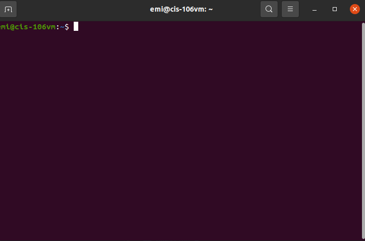
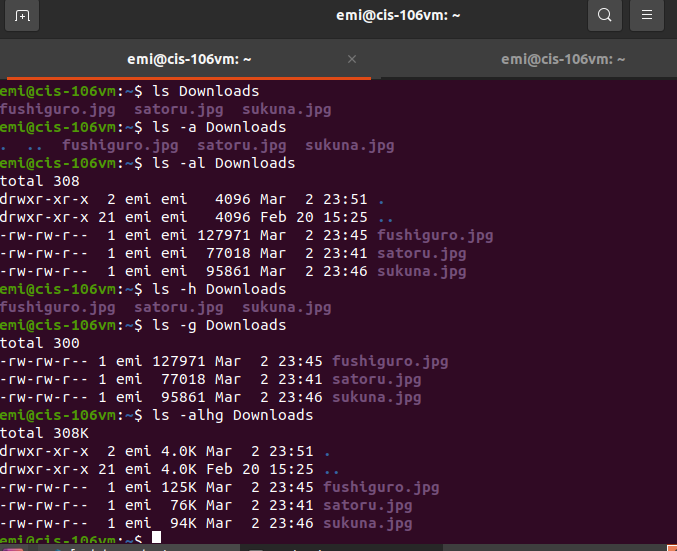
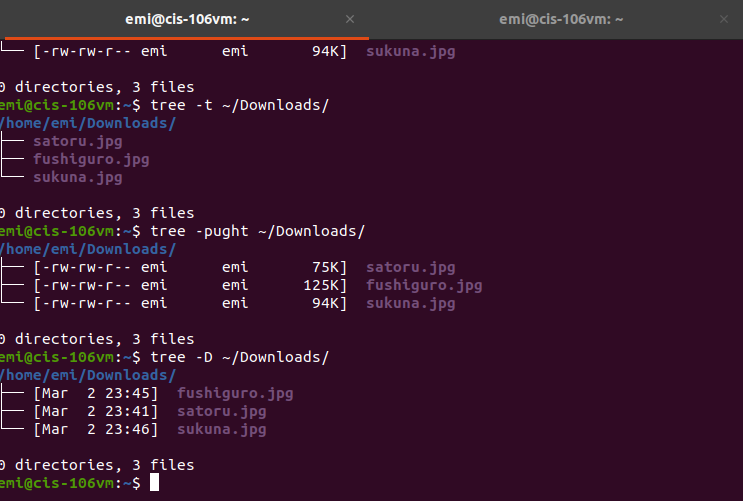
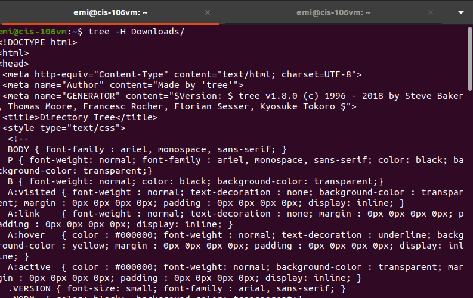
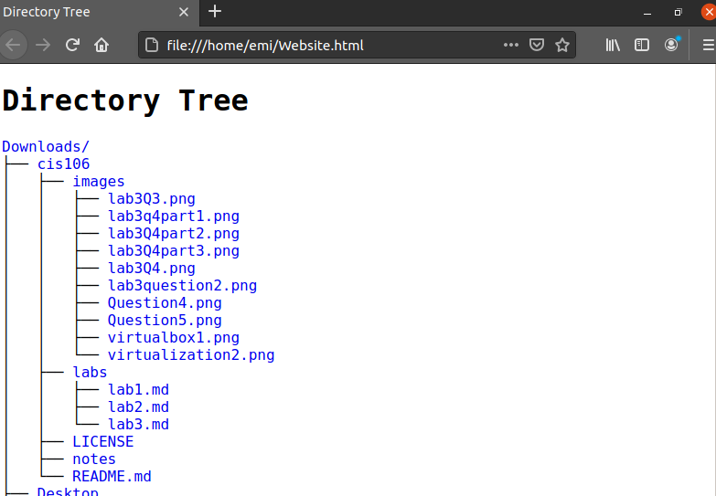
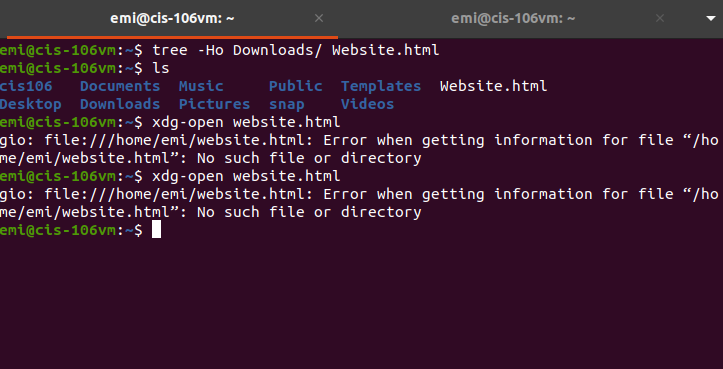
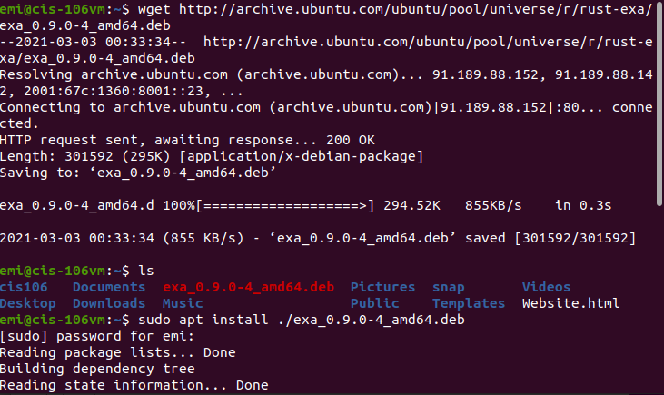
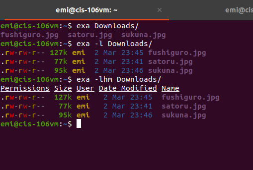

# Lab 3 | Installing software and navigating the file system | Answers
Assignment description [here](https://raw.githubusercontent.com/ra559/cis106/main/labs/lab3.md)

## Question 1
1. Which command did you use to search for the themes and to install them?
   
 to search: apt search 'gkt theme'
 to install: sudo apt install (insert theme name)

2. Which commands did you use to find and install the web browser?

to search: apt search 'web browser'
to install: sudo apt install (firefox)

3.1 What is the name of the package?

- mythbrowser

3.2 What dependencies are needed in order to install the package? (you can either take a screenshot of the terminal or copy and paste from the terminal)

3.3 How much disk space will the package utilize after installation?
 
 476MB

## Question 2

## Question 3git

## Question 4

## Question 5

