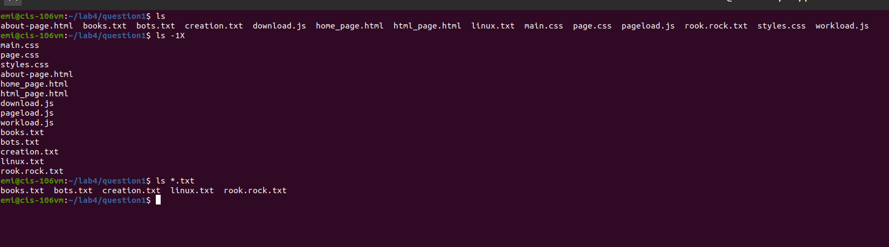
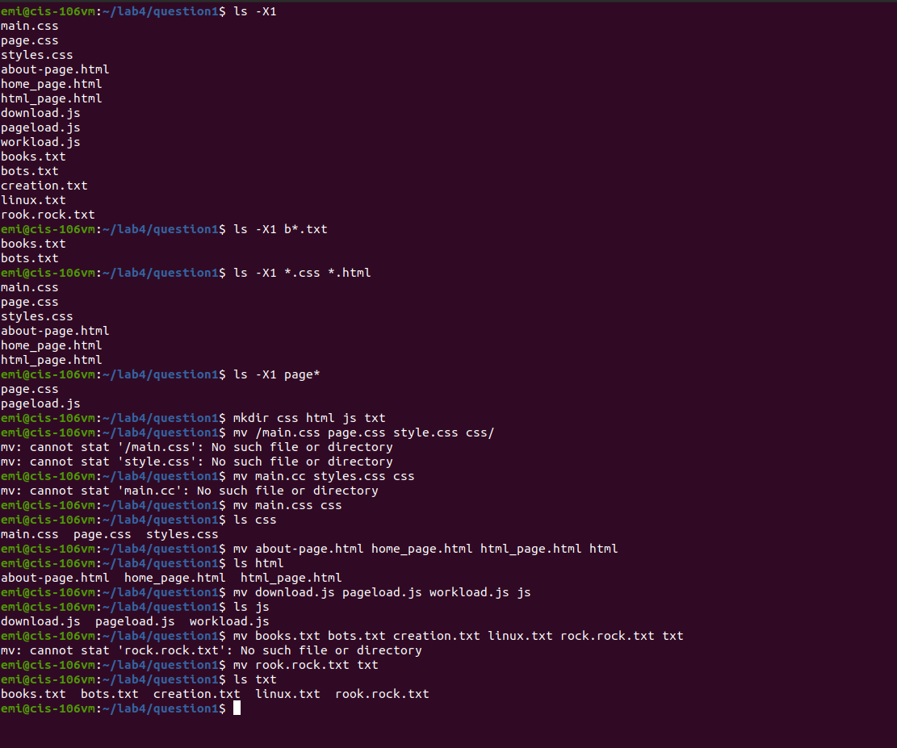
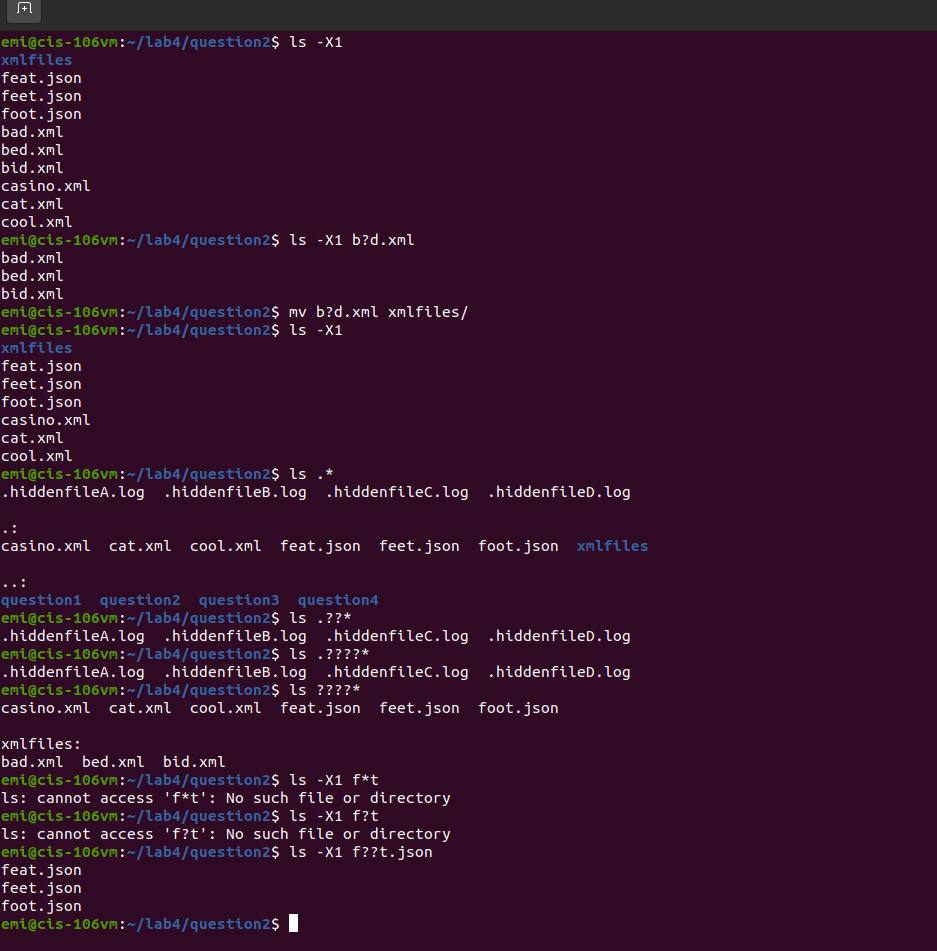
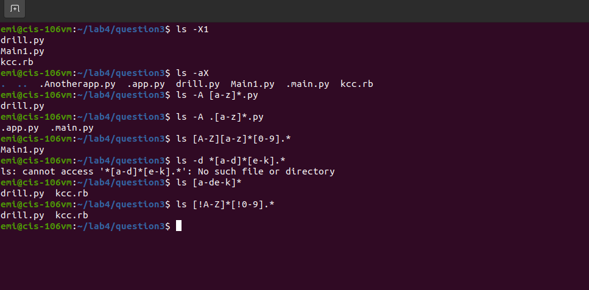
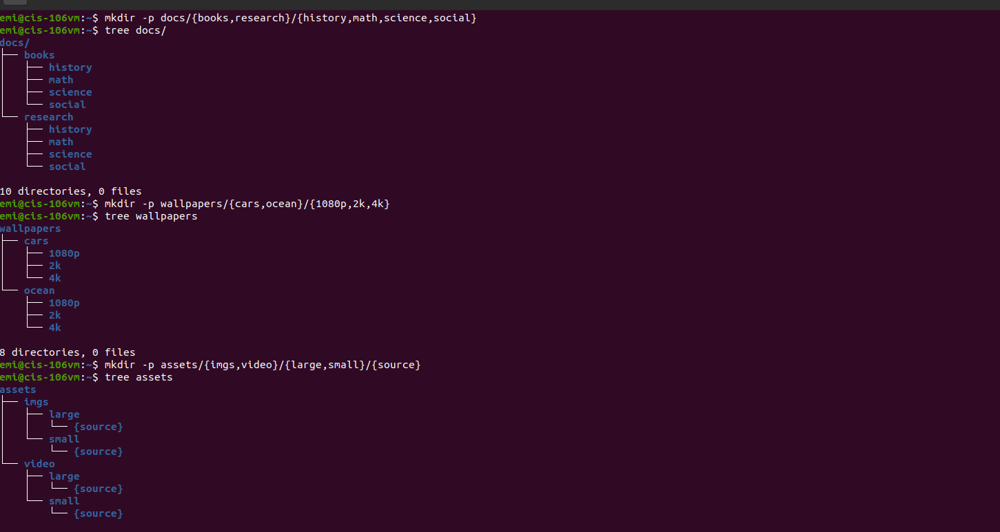
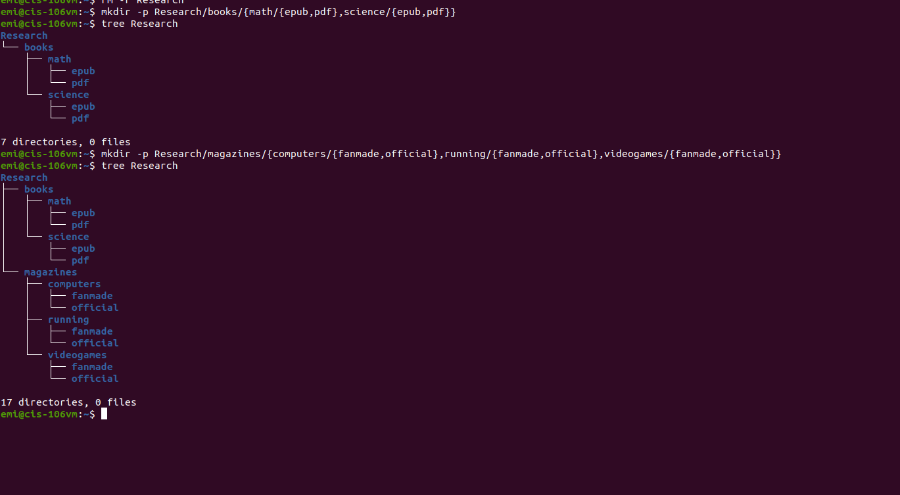
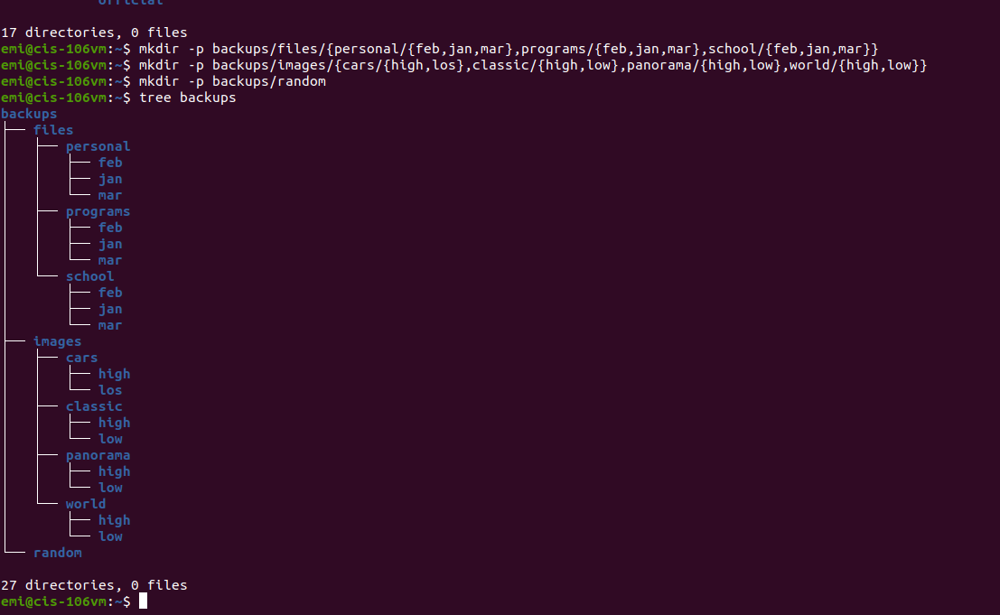

# Lab4.2 | File Globing/wildcards

## Question 1 | Using the * Wildecard

## Question 2 | Using the ? wildcard

## Question 3 | Using the [] wildcard

## Question 4 | Using the brace expansion

git