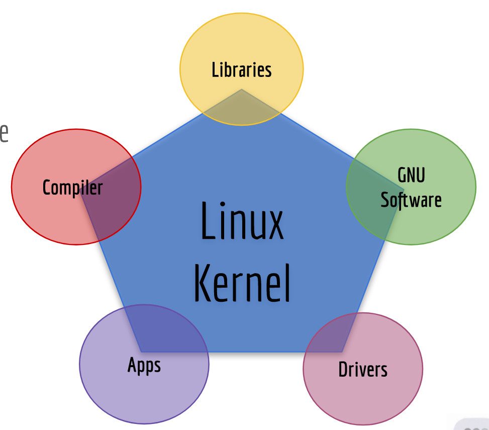
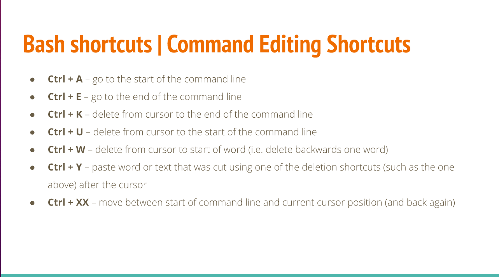
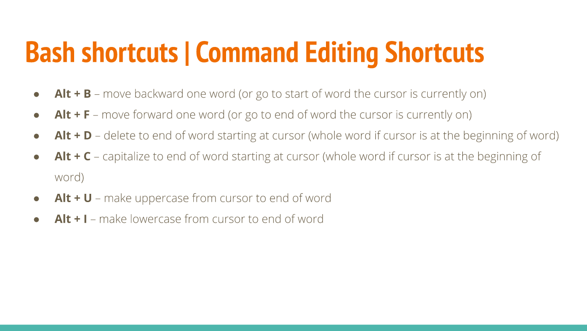
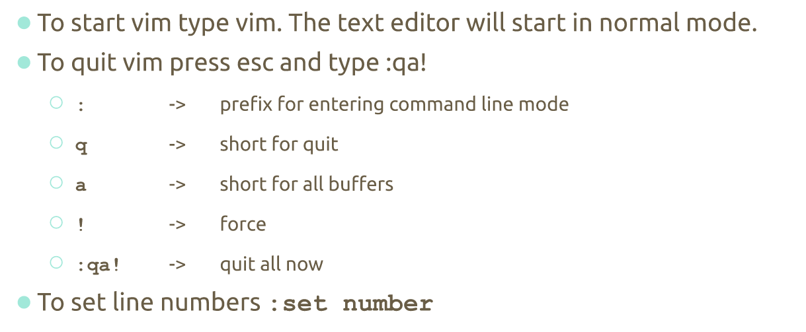
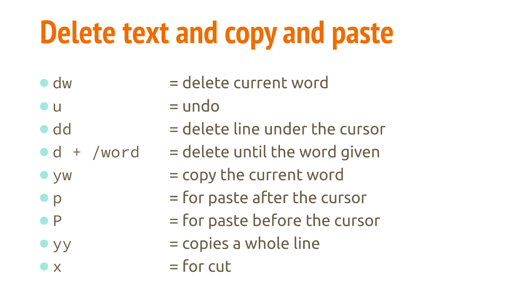
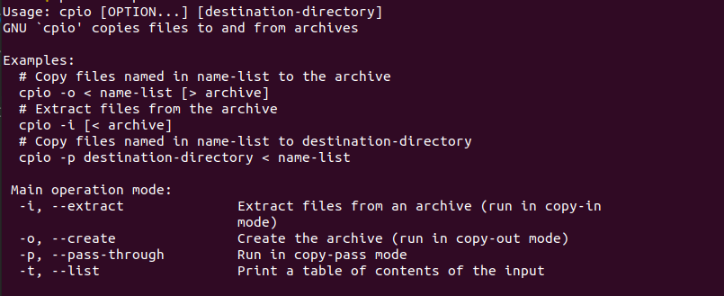

# Final Notes | CIS 106

## Table of Content
- [Final Notes | CIS 106](#final-notes--cis-106)
  - [Table of Content](#table-of-content)
- [Notes Lecture 1 | What is Linux](#notes-lecture-1--what-is-linux)
  - [Why Do you need to learn Linux?](#why-do-you-need-to-learn-linux)
  - [What is Linux?](#what-is-linux)
  - [Linux books I Can Use:](#linux-books-i-can-use)
- [Linux Distributions](#linux-distributions)
  - [Linux Architecture](#linux-architecture)
  - [Software licensing agreement](#software-licensing-agreement)
    - [The 4 freedoms](#the-4-freedoms)
  - [Advantages/Disadvantages od Open Source Software](#advantagesdisadvantages-od-open-source-software)
  - [What is Ubuntu?](#what-is-ubuntu)
- [Notes Lecture 2 | Installing Ubuntu](#notes-lecture-2--installing-ubuntu)
  - [What is Virtualization?](#what-is-virtualization)
  - [Using Virtualbox (optional)](#using-virtualbox-optional)
  - [Installing Ubuntu In a virtual machine](#installing-ubuntu-in-a-virtual-machine)
  - [What is a Raspberry Pi (optional)](#what-is-a-raspberry-pi-optional)
- [Notes Lecture 03 | Learning the Bash Shell](#notes-lecture-03--learning-the-bash-shell)
  - [Exploring Desktop Environments](#exploring-desktop-environments)
  - [What is a Shell?](#what-is-a-shell)
    - [The linux Terminal](#the-linux-terminal)
    - [The Bash Shell:](#the-bash-shell)
      - [Other Commands to try](#other-commands-to-try)
  - [Managing Software](#managing-software)
  - [The Linux Filesystem](#the-linux-filesystem)
    - [Commands](#commands)
    - [Bash Features](#bash-features)
    - [ls command](#ls-command)
- [Notes Lecture 4 | Managing Files and Directories](#notes-lecture-4--managing-files-and-directories)
    - [Creating directories](#creating-directories)
    - [The mkdir command](#the-mkdir-command)
    - [The touch Command](#the-touch-command)
    - [rm command](#rm-command)
    - [mv command](#mv-command)
    - [cp command](#cp-command)
  - [Getting Help](#getting-help)
    - [Using Man page](#using-man-page)
  - [Working with Wild Cards](#working-with-wild-cards)
  - [Shell Expansion](#shell-expansion)
    - [Brace Expansion](#brace-expansion)
- [Notes Lecture 5 | Command Line Text Editors](#notes-lecture-5--command-line-text-editors)
  - [The Basics of nano](#the-basics-of-nano)
  - [The Basics of VIM](#the-basics-of-vim)
    - [How to use VIM | Shortcuts and commands to know](#how-to-use-vim--shortcuts-and-commands-to-know)
    - [VIM modes](#vim-modes)
- [Notes Lecture 6 | Managing Data and File permissions](#notes-lecture-6--managing-data-and-file-permissions)
  - [Managing Data](#managing-data)
    - [Tar Utility](#tar-utility)
    - [CPIO Utility](#cpio-utility)
    - [GIP, Bzip2, xz](#gip-bzip2-xz)
    - [Zip, 7zip and Rar](#zip-7zip-and-rar)
  - [File Permission](#file-permission)
    - [Files Vs Directories](#files-vs-directories)
    - [Symbolic notation](#symbolic-notation)
    - [Numeric notation](#numeric-notation)

<!-- /TOC -->

# Notes Lecture 1 | What is Linux

## Why Do you need to learn Linux?

* Linux runs in a lot of devices. Example: laptops, desktops, servers, smartphones, IoT devices, etc
* Linux powers the cloud
* Linux is used by a lot of companies even Microsoft

## What is Linux?

* Linux is a kernel. A kernel is the core of any operating system
* An operating system that uses the Linux kernel is called a Linux Distribution. Example: Ubuntu and Android
* Linux is multitasking, multi-user, and multipurpose OS.
* Linux is a modular operating system.

## Linux books I Can Use:

* Linux Administration A Beginner's Guide 8th Edition by Wale Soyinka
* CompTia Linux+ Study Guide by  Christine Bresnahan
* The Linux Command Line by William Shotts
  
# Linux Distributions

* There are a large number of Linux distributions.
* There are two main Linux Distributions:
  * Debian
  * Redhat
* There are also other independent distributions:
  * Slackware
  * Arch
  * Gentoo

## Linux Architecture

* Linux is modular which means that users can remove and add/remove whatever they need or don't need.
  * **Kernel** ​= the core of the operating system. Manages the hardware
  * **Daemons​** = background programs that run independent of the user
  * **Shells**​ = the interface that accepts user input and translates it so that the kernel can use it.
  * **Graphical Desktop Environmen​t** = a collection of software that makes the graphical interface

* In Linux everything is a file.
* Type of files:
  * Device files
  * Directory files
  * Binary files
  * Regular files

## Software licensing agreement
* A license agreement outlines the right a user has to given software
* Types of licensing agreement:

Open Source | Closed Source | Free Software
------------|---------------|--------------
Software can be distributed for freeor a fee.**The source code must be distributedwith the software.** | Software can be distributed for freeor a fee. **​The end user has limitedaccess to the software and thesource code is not available** | Software can be distributed for freeor a fee. The user has total control ofthe software and the source code.The software must comply with the 4freedoms.

### The 4 freedoms
* Freedom 0: the user can run the program as you wish, for any purpose 
* Freedom 1: the user can  study how the program works, and change it
* Freedom 2: the user can  redistribute copies
* Freedom 3: the user can distribute copies of your modified versions.

**Learn more:** https://www.gnu.org/philosophy/free-sw.en.html

## Advantages/Disadvantages od Open Source Software

## What is Ubuntu?
Ubuntu is a complete Linux operating system, freely available with both community and professional support. Ubuntu is suitable for both desktop and server use. The current Ubuntu release supports Intel x86 (IBM-compatible PC), AMD64 (x86-64), ARMv7, ARMv8 (ARM64), IBM POWER8/POWER9 (ppc64el), IBM Z zEC12/zEC13/z14 and IBM LinuxONE Rockhopper I+II/Emporer I+II (s390x). Ubuntu includes thousands of pieces of software, starting with the Linux kernel version 5.4 and GNOME 3.28, and covering every standard desktop application from word processing and spreadsheet applications to internet access applications, web server software, email software, programming languages and tools and of course several games.

# Notes Lecture 2 | Installing Ubuntu

## What is Virtualization?
Replication of Hardware to simulate a virtual machine inside a physical machine
**Two general types of virtualization:**
* Server-side virtualization
* Client-side virtualization
  

## Using Virtualbox (optional)
VirtualBox is a powerful type 2 virtualization product for enterprise as well as home use.

* Open Source Software under the GPL version 2
* Runs on: 
  * Windows
  * Linux
  * Macintosh
  * Solaris

**Tutorial Link:** https://www.youtube.com/watch?v=cMRqcbx8JTs

## Installing Ubuntu In a virtual machine
1. Download VirtualBox
2. It will appear a window like this:
   
**Tutorial Link** https://www.youtube.com/watch?v=2MEN_IX8gJ8

## What is a Raspberry Pi (optional)

* The Raspberry Pi is a low cost, credit-card sized computer that plugs into a computer monitor or TV, and uses a standard keyboard and mouse. It's capable of doing everything you'd expect a desktop computer to do.
  

# Notes Lecture 03 | Learning the Bash Shell

## Exploring Desktop Environments
There are two Environments: The DE and the CLI and also there are plenthora of graphical desktops you can choose from linux.

* **GUI**: A graphical user interface is a set of programs that allows a user to interact with the computer system via icons, windows and various other visual elements.
* **DE:**: A desktop environment is an implementation of the desktop metaphor made of a bundle of programs running on top of a computer operating system, which shares a commom GUI, sometimes described as a graphical shell. 
* The most commom one is GNOME and KDE
* A desktop environment provides a predetermined look and feel to the GUI. it is typically broken up into the following graphical sections and functions:
  * Desktop Settings
  * Display Manager
  * File Manager
  * Icons
  * Favorites Bar
  * Launcher
  * Menus
  * Panels
  * System Tray
  * Widgets
  * Window Manager
* **The GNOME DE:** The default desktop in Ubuntu is GNOME 3. It is used not only by Ubuntu but also by several other Linux distributions, such as Debian, Fedora, Red Hat Enterprise Linux, and Oracle Linux. The official GUI for GNOME 3 is called GNOME shell.

## What is a Shell?

### The linux Terminal
* CLI: A command-line interface, means the interaction with the computer and the user. The user issues the commands to the program in the form of successive lines of text.
* There are two ways to access the CLI:
  1. Terminal Emulator
  2. Linux Console
### The Bash Shell:
* The GNU bash shell is a program that provides interactive access to linux system
* Most Linux distributions use the bash shell as the default shell. However, other shells exist

#### Other Commands to try
- date: displays the current time and date
- cal: displays a calendar of the current month
- df: displays the current amount of free space on our disk drives
- free: displays information about your system
- uname: displays information about your system
- clear: clears the screen
  
## Managing Software

## The Linux Filesystem

### Commands 

### Bash Features

### ls command
cleat sheet

# Notes Lecture 4 | Managing Files and Directories

### Creating directories
### The mkdir command
it is used to create a single directory or multiple directories
  type: mkdir + the name of the directory
- Example: create a direcotry with a parent directory at the same time
    - mkdir -p wallpapers_others/movies

### The touch Command
with touch command you can create a file
    type: touch + name of the file
example:

### rm command
rm command removes files
- rmdir: to remove empty directories
- rm -r + directory name: to remove directories
- rm -i: remove a file and prompt confirmation before removal
- rm -I: remove all the files inside a directory and ask before deleting

### mv command
mv moves and renames directories
exaples: 

### cp command
cp copies files/directories from a source to a destination
- cp + files to copy + destination
- cp - r + direcotry to copy + destination : to copy directories use -r option

## Getting Help
### Using Man page
To view the manual of a command type: man + command
- Example: man ls
Other examples

## Working with Wild Cards
wildcard represents letters and characters used to specify a filename for searches
Reference:

## Shell Expansion 
Brace expansion {} is not a wildcard but another feature of bash that allows you to generate arbitrary strings to use with commands
### Brace Expansion

# Notes Lecture 5 | Command Line Text Editors

## The Basics of nano

Nano is a command-line text editor that came with ubuntu by default (it doesn't come with all the distros)
Just type nano in the command-line and it will appear.

## The Basics of VIM
VIM is a command-line text editor which is included in all POSIX compliant operating system
- To install VIM:
    - type: sudo apt install vim
### How to use VIM | Shortcuts and commands to know

**Saving and Quitting VIM**

**Delete text and copy and past**

**Cheat Sheet**
https://vim.rtorr.com/ 

### VIM modes
- insert mode: for writing text
- Normal mode: for manipulating text
- Command mode: for entering the commands
- visual mode: used for navigation and manipulation of text selections
- select mode: similar to visual mode
- Ex-mode: similar to the command-line mode but optimized for batch processing

# Notes Lecture 6 | Managing Data and File permissions

## Managing Data

### Tar Utility

### CPIO Utility

### GIP, Bzip2, xz

### Zip, 7zip and Rar

## File Permission

### Files Vs Directories
| Files | Directories |
|-------|  ---------- |
| **R(read):** Gives users permission to open a file and view its contents | **R(read):** Allows usert to list a directory's contents with commands such as **ls** |
| **W (write):** Gives the user permission to open a file and edit its contents | **W(writes):** Allows users to add or remove files and subdirectories |
| **X(execute):** Allows users to run the file (as long as it's a program or script) | **X(execute):** Allows users to switch to the directory with cd command |

### Symbolic notation
| Category | Operator | Permission|
|----------|----------|-----------|
|u (user)| + (add to existing permission) | r (read)
|g (group) | - (remove from existing permissions) | w (write)|
|o (other) | = (assign absolute permission) | x (execute)|
|a (all) | One of the preceding operators | One or more of the preceding permissions |

### Numeric notation
|Permission| Numeric Value|
|----------|--------------|
|--- | 0|
| --x |1 |
|-w- | 2|
|-wx | 3|
|r-- | 4|
|r-x | 5|
|rw- | 6|
|rwx | 7|

