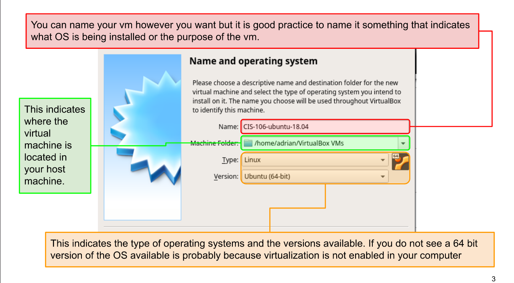

# Notes Lecture 2 | Installing Ubuntu

## What is Virtualization?
Replication of Hardware to simulate a virtual machine inside a physical machine
**Two general types of virtualization:**
* Server-side virtualization
* Client-side virtualization
  

## Using Virtualbox (optional)
VirtualBox is a powerful type 2 virtualization product for enterprise as well as home use.

* Open Source Software under the GPL version 2
* Runs on: 
  * Windows
  * Linux
  * Macintosh
  * Solaris

**Tutorial Link:** https://www.youtube.com/watch?v=cMRqcbx8JTs

## Installing Ubuntu In a virtual machine
1. Download VirtualBox
2. It will appear a window like this:
   
**Tutorial Link** https://www.youtube.com/watch?v=2MEN_IX8gJ8

## What is a Raspberry Pi (optional)

* The Raspberry Pi is a low cost, credit-card sized computer that plugs into a computer monitor or TV, and uses a standard keyboard and mouse. It's capable of doing everything you'd expect a desktop computer to do.
  