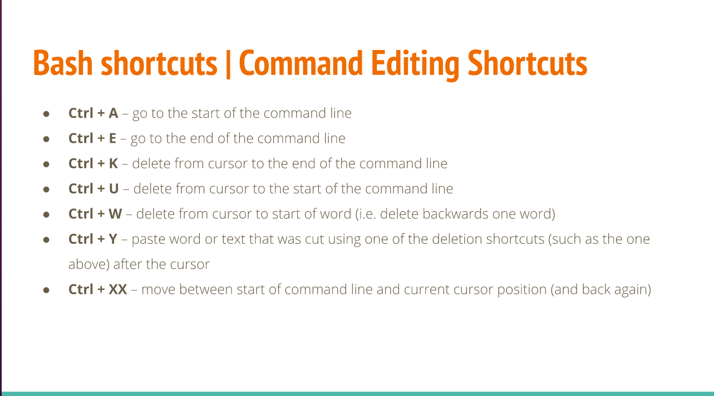
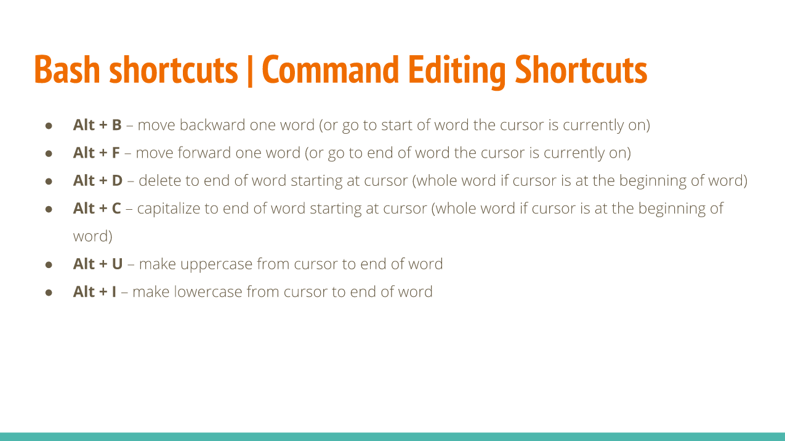

# Notes Lecture 03 | Learning the Bash Shell

## Exploring Desktop Environments
There are two Environments: The DE and the CLI and also there are plenthora of graphical desktops you can choose from linux.

* **GUI**: A graphical user interface is a set of programs that allows a user to interact with the computer system via icons, windows and various other visual elements.
* **DE:**: A desktop environment is an implementation of the desktop metaphor made of a bundle of programs running on top of a computer operating system, which shares a commom GUI, sometimes described as a graphical shell. 
* The most commom one is GNOME and KDE
* A desktop environment provides a predetermined look and feel to the GUI. it is typically broken up into the following graphical sections and functions:
  * Desktop Settings
  * Display Manager
  * File Manager
  * Icons
  * Favorites Bar
  * Launcher
  * Menus
  * Panels
  * System Tray
  * Widgets
  * Window Manager
* **The GNOME DE:** The default desktop in Ubuntu is GNOME 3. It is used not only by Ubuntu but also by several other Linux distributions, such as Debian, Fedora, Red Hat Enterprise Linux, and Oracle Linux. The official GUI for GNOME 3 is called GNOME shell.

## What is a Shell?

### The linux Terminal
* CLI: A command-line interface, means the interaction with the computer and the user. The user issues the commands to the program in the form of successive lines of text.
* There are two ways to access the CLI:
  1. Terminal Emulator
  2. Linux Console
### The Bash Shell:
* The GNU bash shell is a program thta provides interactive access to linux system
* Most Linux distributions use the bash shell as the default shell. However, other shells exist

## Managing Software

## The Linux Filesystem