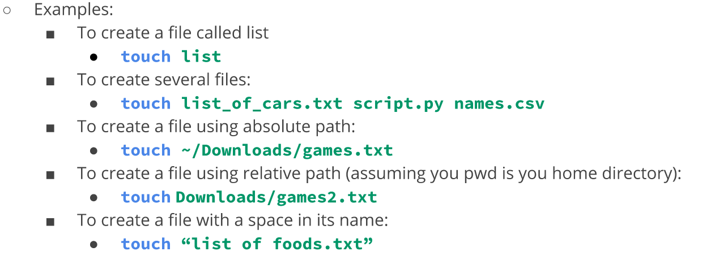
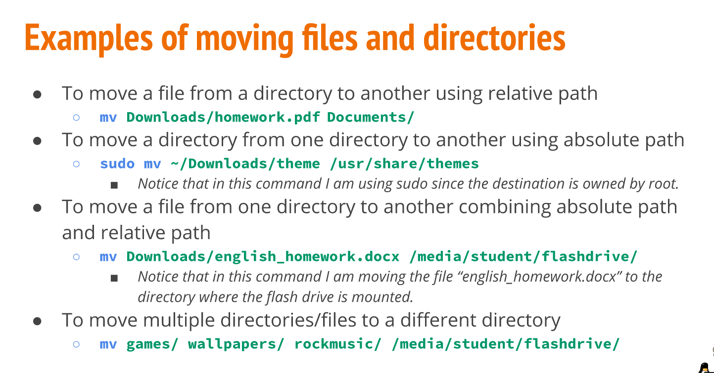
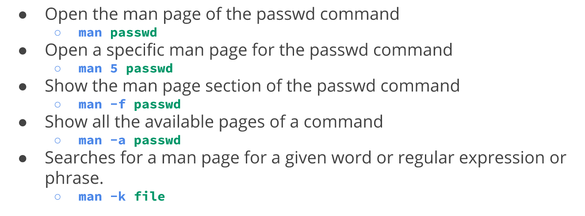
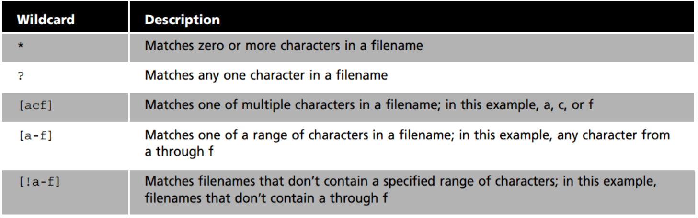

# Notes Lecture 4 | Managing Files and Directories

### Creating directories
### The mkdir command
it is used to create a single directory or multiple directories
  type: mkdir + the name of the directory
- Example: create a direcotry with a parent directory at the same time
    - mkdir -p wallpapers_others/movies

### The touch Command
with touch command you can create a file
    type: touch + name of the file
example:

### rm command
rm command removes files
- rmdir: to remove empty directories
- rm -r + directory name: to remove directories
- rm -i: remove a file and prompt confirmation before removal
- rm -I: remove all the files inside a directory and ask before deleting

### mv command
mv moves and renames directories
exaples: 

### cp command
cp copies files/directories from a source to a destination
- cp + files to copy + destination
- cp - r + direcotry to copy + destination : to copy directories use -r option

## Getting Help
### Using Man page
To view the manual of a command type: man + command
- Example: man ls
Other examples

## Working with Wild Cards
wildcard represents letters and characters used to specify a filename for searches
Reference:

## Shell Expansion 
Brace expansion {} is not a wildcard but another feature of bash that allows you to generate arbitrary strings to use with commands
### Brace Expansion

