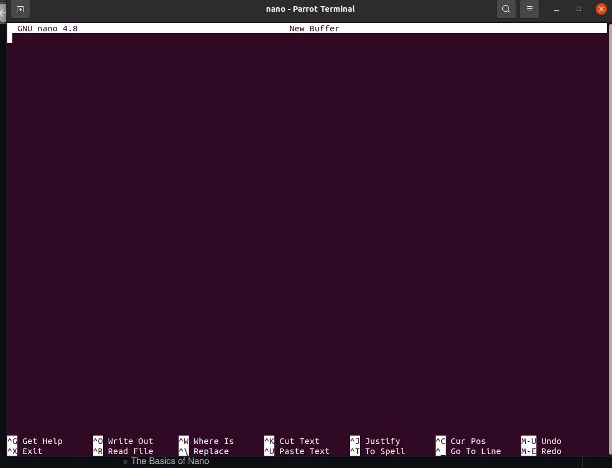
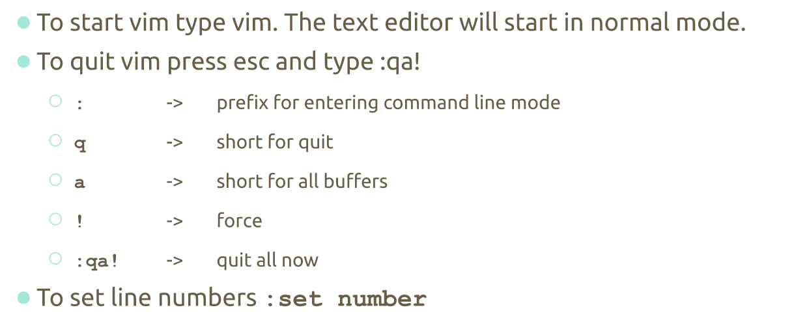
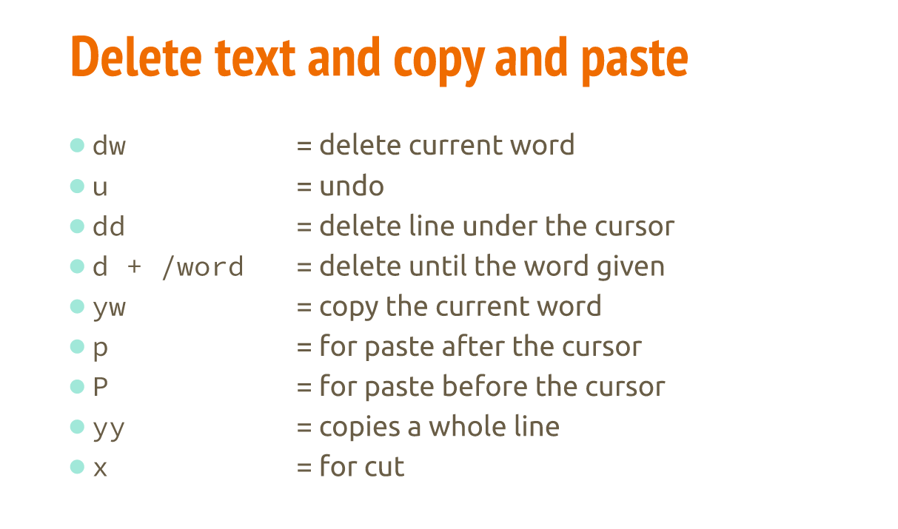

# Notes Lecture 5 | Command Line Text Editors

## The Basics of nano

Nano is a command-line text editor that came with ubuntu by default (it doesn't come with all the distros)
Just type nano in the command-line and it will appear.

## The Basics of VIM
VIM is a command-line text editor which is included in all POSIX compliant operating system
- To install VIM:
    - type: sudo apt install vim
### How to use VIM | Shortcuts and commands to know

**Saving a Quitting VIM**

**Delete text and copy and past**

**Cheat Sheet**
https://vim.rtorr.com/ 

### VIM modes
- insert mode: for writing text
- Normal mode: for manipulating text
- Command mode: for entering the commands
- visual mode: used for navigation and manipulation of text selections
- select mode: similar to visual mode
- Ex-mode: similar to the command-line mode but optimized for batch processing
  