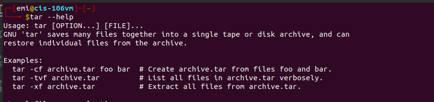
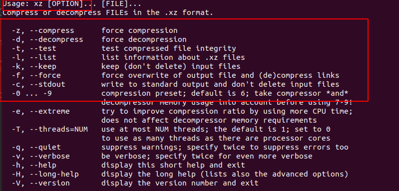
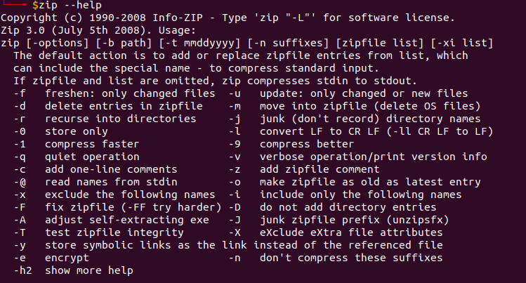

# Notes Lecture 4 | Managing Data and File permissions

## Managing Data

### Tar Utility

### CPIO Utility

### GIP, Bzip2, xz

### Zip, 7zip and Rar

## File Permission

### Files Vs Directories
| Files | Directories |
|-------|  ---------- |
| **R(read):** Gives users permission to open a file and view its contents | **R(read):** Allows usert to list a directory's contents with commands such as **ls** |
| **W (write):** Gives the user permission to open a file and edit its contents | **W(writes):** Allows users to add or remove files and subdirectories |
| **X(execute):** Allows users to run the file (as long as it's a program or script) | **X(execute):** Allows users to switch to the directory with cd command |

### Symbolic notation
| Category | Operator | Permission|
|----------|----------|-----------|
|u (user)| + (add to existing permission) | r (read)
|g (group) | - (remove from existing permissions) | w (write)|
|o (other) | = (assign absolute permission) | x (execute)|
|a (all) | One of the preceding operators | One or more of the preceding permissions |

### Numeric notation
|Permission| Numeric Value|
|----------|--------------|
|--- | 0|
| --x |1 |
|-w- | 2|
|-wx | 3|
|r-- | 4|
|r-x | 5|
|rw- | 6|
|rwx | 7|
